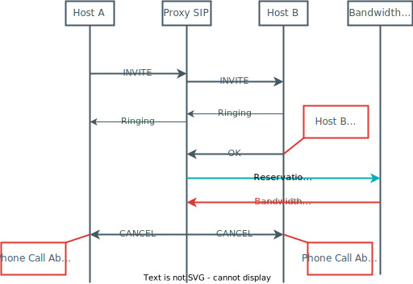

<!-- _footer: 'Théo Fontana - Lauric Marthrin-John - Dimitrios Nixarlidris -   Vatosoa Razafiniary - Tomás Ubaldi - 4IR 2022' -->
<style>
img[alt="insa"] { 
  position: absolute;
  top: 2em;
  width:  7em; 
  display: block;
}
</style>


# Bureau d'étude <br>Qualité de service dans l'internet 

---

## Summary

1. Introduction
2. Objectives
3. Our choices
4. Work overview
5. Demonstration
6. Conclusion

---
## Introduction

Project organisation
* International team of 5 people
* 2 Tutorial classes  
* 3 Labs
* 1 Final integration day 


---
## Objectives

**We need to ensure :**
* Connectivity between hosts on all client's sites
* QoS for VoIP applications

**Two network management aproachs :**
* Static for the core network
* Dynamic for QoS requests


---
## Our choices

* Core network using MPLS 
* VPN-IP tunnel for establishing connection between client's sites
* Bandwidth Broker is a Python web application
* CEs configurations are done via ssh
* Proxy SIP exchange with the BB via http requests

---
## Core Network

<!-- _class:fontsize:small-->
<style scoped>
p{
    font-size: em;
    //margin:0
}
ul{
    margin:0;
}
li{
  font-size: .85em;
}
</style>
**We used**

* Cisco Router for PE
* Linux Router for CE
* Switch to connect client's hosts 

**We setup**
* MPLS cloud with OSPF & LDP
* VPN-IP
    * BGP between PE
    * vrf on every PE
* PHB on every core router to ensure QoS 

---
## Core Network
**Our Addressing Plan**


---
## Proxy SIP
* WireShark capure during labs

<style>
img[alt="SIP_screenshot"] { 
  width:  70%; 
  position: absolute;
  bottom:2%;
  left: 50%;
  transform: translateX(-50%);

}
</style>
---
## Proxy SIP

<style>
img[alt="reservation_ok"] { 
  position: absolute;
  top: 25%;
  left: 50%;
  transform: translateX(-50%);
  width:  17em; 
}
</style>


---
## Proxy SIP

<style>
img[alt="reservation_failed"] { 
  position: absolute;
  top: 25%;
  left: 50%;
  transform: translateX(-58%);
  width:  20em; 
}
</style>


---
## Proxy SIP

<style>
img[alt="communication_end"] { 
  position: absolute;
  top: 25%;
  left: 50%;
  transform: translateX(-50%);
  width:  17em; 
}
</style>


---
## Proxy SIP

Insert request to the BB inside Proxy code

```Java
process ReponseStatelessly() 
    // [...]
    if (cseqHeader.getMethod().equals("INVITE")) {
        SIPREsponse sr = (SIPREsponse) response 
    }
```
* The part we struggled the most on :cry:
---

## Comminication Proxy SIP <-> BB

GET request with Json atached

* Exemple of Json for a reservation
``` json
    {
        "id":"Resa_1",
        "streams" : [
            {
                "portDest" : "1234",
                "addrDest" : "192.168.1.1",
                "portSrc" :"1234",
                "addrSrc" : "192.168.2.1"
            },                                                                                                                                          
            {
                "portDest" : "1234",
                "addrDest" : "192.168.2.1",
                "portSrc" :"1234",
                "addrSrc" : "192.168.1.1"
            }
        ],
        "tspec": 100
    }
```

---
## Trafic classification

* Creation of a Hierachical Token Bucket
    * Best effort
    * Premium trafic
* We use iptable to set DSCP field
<style>
img[alt="HTBDiagram"] { 
  position: absolute;
  top: 35%;
  left: 55%;
  width:  12em; 
}
</style>


---
## Bandwidth Broker

Initialisation

```Python
# Create CEs
CE1= CE('CE1', '192.168.1.2')
CE2= CE ('CE2', '193.168.2.22')
CE3= CE ('CE3', '193.168.3.33')

# Create SLAs 
SLA1 = SLA(id='SLA1', clientNetwork=IPv4Network('192.168.1.0/24'), CE=CE1, capacity=1000)
SLA2 = SLA(id='SLA2', clientNetwork=IPv4Network('192.168.2.0/24'), CE=CE2, capacity=1000)
SLA3 = SLA(id='SLA3', clientNetwork=IPv4Network('192.168.3.0/24'), CE=CE3, capacity=1000)

client_SLAs=[SLA1,SLA2,SLA3]
Active_Reservations=[]
Deleted_Reservations=[]
Failed_Reservations=[]
```
---

## Bandwidth Broker

Initial CE configuration

```Python
def getInitConfig(CE):
    '''
        Return the list of commands to send to the router to unprotect all stream in streams  
    '''
    config_commands =[]
    # Create the HTB structure
    config_commands.append(f'tc qdisc del dev {CE.interface} root')
    config_commands.append(f'tc qdisc add dev {CE.interface} root handle 1: htb default 2')
    config_commands.append(f'tc class add dev {CE.interface} parent 1: classid 1:1 htb rate {CE.premium_br}kbit ceil {CE.premium_br}kbit')
    config_commands.append(f'tc class add dev {CE.interface} parent 1: classid 1:2 htb rate 0kbit ceil {CE.premium_br}kbit')
    config_commands.append(f'tc class add dev {CE.interface} parent 1:1 classid 1:10 htb rate {CE.control_br}kbit ceil {CE.premium_br}kbit')
    # Put packet with mark=11 in the control queue
    config_commands.append(f'tc filter add dev {CE.interface} parent 1:0 protocol ip prio 1 handle 11 fw flowid 1:10')
    # Set mark = 11 for packet addessed to 192.168.1.2 = Proxy SIP
    config_commands.append(f'iptables -A PREROUTING -t mangle -d 192.168.1.2 -j MARK --set-mark 11')
    #Set the DSCP field to ensure QoS in core network
    config_commands.append(f'iptables -A POSTROUTING -t mangle -d 192.168.1.2 -j DSCP --set-DSCP EF')
    
    return config_commands
```

---

## Bandwidth Broker

Reservation handeler

```Python
@app.route('/ask-resa', methods=['GET'])
def ask_resa():
    request_data = request.get_json()
    # [...]
    if request_data:
        # [...]
        new_resa=Resa(id=id, streams=streams, tspec=tspec,client_SLAs=client_SLAs) # Create a reservation   
        resa_OK = new_resa.askResa() # Check if the reservation is possible
        if resa_OK :  # Respond to the request accordingly
            Active_Reservations.append(new_resa)
            return str(resa_OK)
        else :
            Failed_Reservations.append(new_resa)
            return 'Reservation failed', 400
    return 'Bad request', 400
```

---
## Bandwidth Broker

CE configuration on new reservation

``` Python
def getBookingConfig(CE,streams, tspec):
    '''
        Return the list of commands to send to the router to protect all stream based on the tspec requested
    '''
    config_commands =[]
    # Create a new queue
    config_commands.append(f'tc class add dev {CE.interface} parent 1:1 classid 1:{CE.next_queue_id} htb rate {tspec}kbit ceil {tspec * 1.5}kbit')
    # Association mark <-> queue
    config_commands.append(f'tc filter add dev {CE.interface} parent 1:0 protocol ip prio 1 handle 11 fw flowid 1:{CE.next_queue_id}')
    for stream in streams :
        if CE.ipAddress.network == stream.addrSrc.network :
            # Set the MARK based on destination address
            config_commands.append(f'iptables -A PREROUTING -t mangle -d {stream.addrDest.ip} -j MARK --set-mark 11')
            # Set the DSCP field to ensure QoS in core network
            config_commands.append(f'iptables -A POSTROUTING -t mangle -d {stream.addrDest.ip} -j DSCP --set-DSCP EF')

    return config_commands
```
---

## Bandwidth Broker

Cancel a reservation

```Python
@app.route('/remove-resa', methods=['GET'])
def remove():
    request_data = request.get_json()
    # [...]
    if request_data:
        if 'streams' in request_data:
            streams = getStreamsfromJson(request_data['streams'])  
            matching_resa = find_matching_resa(streams,Active_Reservations) #                          
        if matching_resa != None :
            matching_resa.cancelResa()
            Active_Reservations.remove(matching_resa)
            Deleted_Reservations.append(matching_resa)
            return f'{matching_resa.id} has been remove'
        else:
            return 'No reservation with matching streams', 400

    return 'Bad request', 400
```
---
<!-- _class: lead --> 
# Demonstration
:pray:

---
## Conclusion

**What we manage to do**
* Create an MPLS core network
* Dynamicly protect streams based on @IPdest
* Create a dashboard to monitor network's state

**Possible amelioration**
* Better integration with the Proxy 
* Test traffic control and iptable configuration 
* What about a multi domain internet ?
